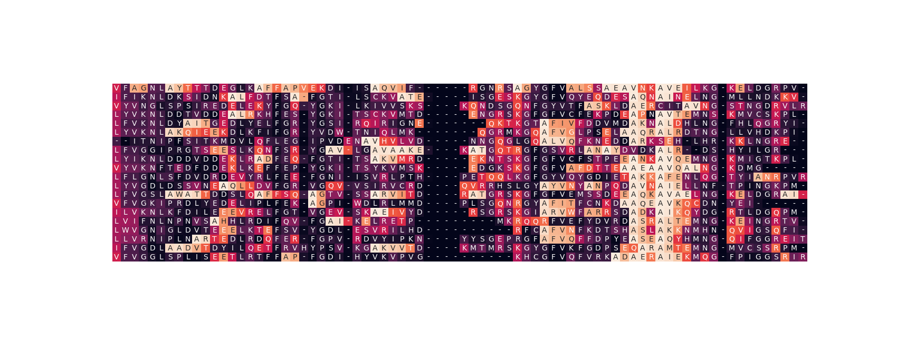
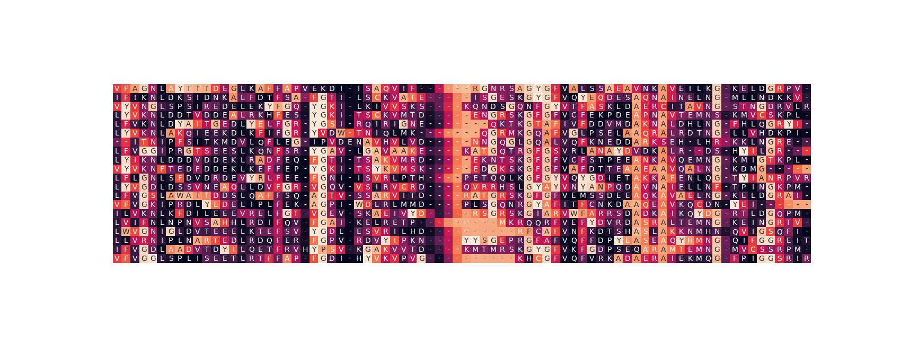

# Latent Representation for RNA Recognition Motifs
Data Science Capstone Project for Millie Dwyer, Julie Helmers, Shasha Lin, and Lihan Yao

## How can this representation be used?
After processing RNA Recognition Motif data from Uniprot, our models complete unsupervised learning on this input to generate an embedding.

Our embeddings can be utilized as input for: 
- Affinity Regression
- Sequence Fitness Prediction (under construction)

## Awards
NYU Center for Data Science Academy Award: Best Interdisciplinary Project, 2018 

## Viz
[Visualization of partial RRM latent representation using t-SNE projection (representation generated by NMT model) ](https://plot.ly/~mrnood/108)

    

A Recurrent Neural Network's neurons can capture meaningful features of biological sequences. Below are activation patterns of two neurons taken from a RNN layer of our model over the same batch of sequence data. Brighter amino acid cells indicate stronger activations from that neuron.      

